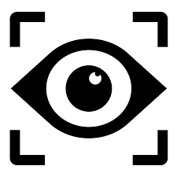
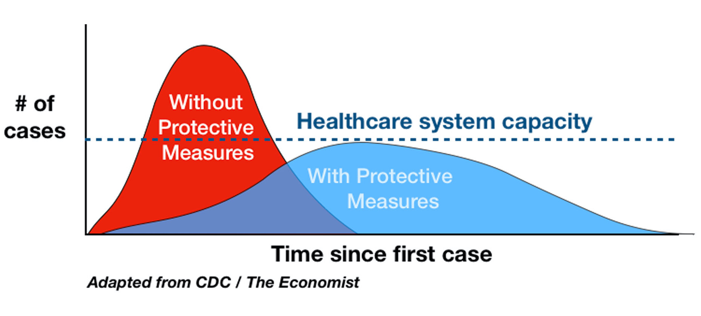
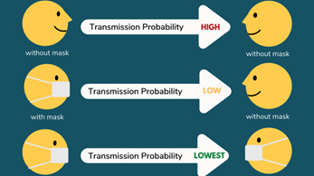

# Hospital of the Future - Monitoring Social Distancing 

<p align="center">
    

  <h3 align="center">Computer Vision</h3>

  <p align="center">
    Using Computer Vision to enforce Social distancing
  </p>
</p>

<!-- TABLE OF CONTENTS -->
## Table of Contents

* [About the Project](#about-the-project)
* [Setup](#setup)
  1. [Download Docker](#download-docker)
  2. [Proximity Detection Model](#proximity-detection-model)
    <!-- * [Prerequisites for Proximity Detection Model](#prerequisites-for-proximity-detection-model)
    * [Steps to Run Proximity Detection Model](#steps-to-run-proximity-detection-model)
        * [Run Proximity Detection Model Server as a Container](#run-proximity-detection-model-server-as-a-container)
        * [Run Proximity Detection Model Server as a Process](#run-proximity-detection-model-server-as-a-process)
        * [Run Proximity Detection Model Client as a Process](#run-proximity-detection-model-client-as-a-process) -->
  3. [Face Mask Detection Model](#face-mask-detection-model)
    <!-- * [Prerequisites for Face Mask Detection Model](#prerequisites-for-face-mask-detection-model)
    * [Steps to Train Face Mask Detection Model](#steps-to-train-face-mask-detection-model)
        * [Setting Up Data for Face Mask Detection Model](#setting-up-data-for-face-mask-detection-model)
        * [Training Face Mask Detection Model](#training-face-mask-detection-model)
    * [Steps to Run Face Mask Detection Model](#steps-to-run-face-mask-detection-model)
        * [Run Face Mask Detection Model Server as a Container](#run-face-mask-detection-model-server-as-a-container)
        * [Run Face Mask Detection Model Server as a Process](#run-face-mask-detection-model-server-as-a-process)
        * [Run Face Mask Detection Model Client as a Process](#run-face-mask-detection-model-client-as-a-process) -->
* [Eventual Impact](#eventual-impact)
* [Demo Videos](#demo-videos)

## About The Project
These are developed containerized computer vision models for the detection of people violating health protocols.

We built two computer vision models for the following problems:	
* #### Proximity Sensing and Social Distancing :
    To detect if people within the field of view are maintaining appropriate distance between each other.
    * #### Proposed Solution
        Our model uses OpenCV with a prebuilt MobilenetSSD model to detect all the people in the field of view.
        We monitor the Euclidean distance of the centroids of each person within the frame.
        To deal with depth elevating the camera to a height proved to be the best solution as depth gets filtered out onto the 2D image view.

<p align="center">
    
</p>

* #### Mask Compliance :
    To detect if people within the field of view are wearing a face mask.
    * #### Proposed Solution
        Here we built an image pipeline, where faces were detected and extracted from an image using an OpenCV pertained caffe model. Each of these faces were passed through our model which detected whether everyone was wearing a face mask or not.

<br>
<p align="center">
    
</p>
<br>

<!-- GETTING STARTED -->
## Setup
* ### Download Docker
    [Download](https://www.docker.com/products/docker-desktop) Docker on the system, if you want to run models in a container.

* ### Proximity Detection Model
    * #### Prerequisites for Proximity Detection Model
        When in the vision_models/proximity_detection directory,
        Enter the following line into the terminal -
        ```
            pip install requirements.txt
        ```
    * #### Steps to Run Proximity Detection Model
        * #### Run Proximity Detection Model Server as a Container
            Once Docker is up and running,
            Open terminal in the vision_models/proximity_detection directory.
            Enter the following line into the terminal -
            ```
                docker container run -p 5001:5001 proximity_detector
            ```
        * #### Run Proximity Detection Model Server as a Process
            Open terminal in the vision_models/proximity_detection/app directory.
            Enter the following line into the terminal -
            ```
                python score.py
            ```
        * #### Run Proximity Detection Model Client as a Process
            Open terminal in the vision_models/proximity_detection directory.
            Enter the following line into the terminal -
            ```
                python eval.py
            ```

* ### Face Mask Detection Model
    * #### Prerequisites for Face Mask Detection Model
        When in the vision_models/face_mask_detection directory,
        Enter the following line into the terminal -
        ```
            pip install requirements.txt
        ```
    * #### Steps to Train Face Mask Detection Model
        * #### Setting Up Data for Face Mask Detection Model
            When you open Microsoft_Vision/face_mask_detection/dataset
            you will see two folders labelled as with_mask and without_mask,
            you can add more data to these folders to improvise training.
        * #### Training Face Mask Detection Model
            When in the vision_models/face_mask_detection directory,
            Enter the following line into the terminal -
            ```
                python train.py
            ```
    * #### Steps to Run Face Mask Detection Model
        * #### Run Face Mask Detection Model Server as a Container
            Once Docker is up and running,
            Open terminal in the vision_models/face_mask_detection directory.
            Enter the following line into the terminal -
            ```
                docker container run -p 5000:5000 mask_detector
            ```
        * #### Run Face Mask Detection Model Server as a Process
            Open terminal in the vision_models/face_mask_detection/app directory.
            Enter the following line into the terminal -
            ```
                python score.py
            ```
        * #### Run Face Mask Detection Model Client as a Process
            Open terminal in the vision_models/face_mask_detection directory.
            Enter the following line into the terminal -
            ```
                python eval.py
            ```

## Eventual Impact

These models could be deployed on any smart camera at public places to help enforce healthcare protocols and safety standards. This in turn can help curb the spread of various contagious diseases like COVID-19.


## Demo Videos
* ### Proximity Detection:
    [](https://youtu.be/Tiz2aNBoUJI) 
* ### Face Mask Detection:
    [](https://youtu.be/eO2n-YhcejI) 

<!-- https://www.google.com/url?sa=i&url=https%3A%2F%2Fhackernoon.com%2Fthe-interface-becomes-everything-19e9c27d525c&psig=AOvVaw2bsu5ioBfUURNeA6ZBnw3r&ust=1600888788709000&source=images&cd=vfe&ved=0CAMQjB1qFwoTCJiS58y9_esCFQAAAAAdAAAAABAD -->